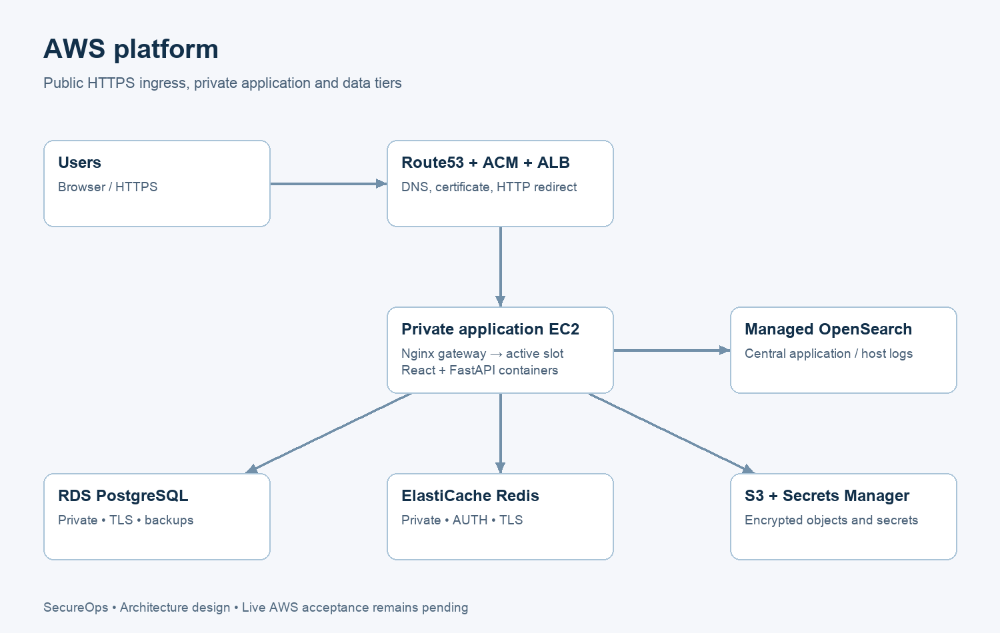

# SecureOps — DevSecOps Platform on AWS

A service-operations portal and a reproducible deployment platform for learning production engineering: authentication, service/deployment/incident tracking, security gates, private AWS networking, observability and recovery.

**Status: the application works locally; this project is not yet production-complete.** The [requirement audit](docs/project-audit.md) maps the supplied plan to code and evidence. AWS deployment, Jenkins execution, authenticated staging DAST, alert delivery, live rollback and RDS restore still require validation. The image/security gates currently block release; see [security findings](docs/security-review.md).



## Start locally

Requirements: Docker with Compose 2.30+, about 2 GB free memory for the application stack and sufficient disk space for images. The optional observability stack needs several additional GB. Node 24.15+ and Python 3.14 are needed for host-side development/testing.

```sh
python3 scripts/init-local.py    # creates private .env; never overwrites it
docker compose up -d --build --wait --wait-timeout 180
```

Open **http://127.0.0.1:8080** and register a Viewer account. Role seeding and Alembic migrations run before the API starts. Create an administrator interactively when needed:

```sh
docker compose exec backend python -m scripts.create_admin
```

The project name is `secureops-platform`, with independent database/cache volumes. Only the Nginx port is exposed, bound to loopback. `docker compose down` retains data; do not add `--volumes` unless intentionally deleting this local database. The `.env` file is ignored by Git. A separate pre-existing container named `secureops-postgres` is not part of this Compose project.

For a Vite/host API workflow, use `compose.dev.yaml` with the base file. PostgreSQL is optionally mapped to **127.0.0.1:55433**, avoiding the existing host database port. See [backend](backend/README.md) and [frontend](frontend/README.md) development instructions.

## Stack and repository

| Path | Purpose |
|---|---|
| `backend/` | FastAPI, SQLAlchemy, PostgreSQL migrations, Argon2/JWT/RBAC, audit trails and tests |
| `frontend/` | React/TypeScript portal, protected routes, token rotation, operational pages and tests |
| `compose*.yaml`, `docker/` | Local services, production slots, Nginx gateway and observability |
| `infrastructure/terraform/` | State bootstrap, shared AWS modules and dev/staging/prod environments |
| `infrastructure/ansible/` | Private-instance setup/deployment over AWS Systems Manager |
| `pipelines/Jenkinsfile` | Tests, scans, staging verification, approval and production deployment |
| `scripts/`, `security/` | Smoke checks, release automation, scanners, backup/restore tools |
| `monitoring/`, `logging/` | Prometheus, Grafana, Alertmanager, Fluent Bit and retention policy |
| `docs/`, `diagrams/` | Audit, evidence, architecture and operational runbooks |

The four environments are local, dev, staging and production. Use `feature/* → develop → release/* → main`; `hotfix/*` branches target main with a backport to develop. Configure repository protections and required checks before enabling production. The pipeline promotes production only from `main`; this does not create/protect that branch automatically.

## Application and security

Users register as Viewers. Admins manage users/roles and all resources; Engineers operate projects/services/deployments/incidents; Viewers read permitted resources. The API checks current user status and role in the database. Access tokens are short-lived; refresh tokens rotate atomically and are revoked on logout. The browser stores refresh tokens in local storage, so XSS prevention and CSP remain essential. Cross-tab refresh coordination remains a follow-up.

`/health/live` checks the process. `/health/ready` requires PostgreSQL and Redis. `/api/v1/openapi.json` provides the API schema. Private `/metrics` exposes HTTP, database and login-failure metrics. Nginx applies authentication rate limits, security headers and request IDs. API mutation audit records commit with their business changes.

AWS uses a public ACM-backed ALB, private EC2 application hosts, isolated RDS/Redis subnets, restricted security groups, SSM access, encrypted storage, immutable ECR tags and runtime Secrets Manager retrieval. [Infrastructure setup](infrastructure/README.md) documents account/domain inputs, state locking, secret provisioning and the remaining production hardening work, including a restricted DB application login.

Follow the [AWS hosting guide](docs/aws-hosting.md) for account setup, private credential templates, provisioning, first-account creation, deployment and operational verification. All private values in [AWS templates](infrastructure/aws/) are `********` placeholders.

## Delivery and operations

The Jenkins pipeline runs lint, unit/API tests, Semgrep, dependency/secret/filesystem/IaC scans, Docker builds and Trivy image scans. It publishes Git SHA tags, resolves ECR digests, deploys staging, runs authenticated smoke/DAST checks, and requires release-manager approval before main-branch production deployment. Reports are retained as build artifacts. See [CI setup](docs/ci-cd.md); a live Jenkins controller and deployment identities are prerequisites.

Production uses two local application slots per EC2 host. A serialized deployment pulls digests, migrates the database, checks the candidate, switches the stable gateway and verifies health/ALB status. Failed switches restore the current release; manual rollback restores the recorded previous release. Database migrations must remain backward compatible. See the [deployment runbook](docs/runbooks/deployment.md).

Optional local observability:

```sh
docker compose -f compose.yaml -f compose.observability.yaml up -d
```

Grafana is at `http://127.0.0.1:3000` (admin password in local `.env`), Prometheus at `http://127.0.0.1:9090`. Dashboards cover infrastructure, application and deployments. Metrics retain 15 days; the OpenSearch policy retains logs 30 days once installed. Local OpenSearch has security disabled on an internal network with no host port; never use that configuration in production. Production uses private managed OpenSearch with TLS and signed requests, plus SSM-only monitoring interfaces. Notification delivery and index-policy installation must be tested, not assumed from configuration files.

RDS backups retain 7 days in dev/staging and 14 in production. The local restore drill actually restored all nine tables and compared their data hashes. It does not establish that RDS restoration works. See [backup and restore](docs/runbooks/backup-restore.md), [incident response](docs/runbooks/incidents.md), and [disaster recovery](docs/runbooks/disaster-recovery.md).

## Validation and presentation

```sh
python3.14 -m venv backend/.venv
backend/.venv/bin/pip install -r backend/requirements-dev.txt
cd frontend && npm ci && cd ..
make test
make lint
```

Earlier successful checks: **62 backend tests, 9 frontend tests, 8 platform tests**, frontend build/lint, all four Terraform configurations and four Ansible playbook syntax checks. Application containers and same-origin browser authentication were verified before Docker storage became read-only. The final backend rerun was blocked by PostgreSQL read-only storage (1 failure, 51 setup errors); it must be rerun after Docker recovery. See the [evidence summary](docs/evidence/validation-summary.json) and [audit](docs/project-audit.md) for limits and failed checks.

Architecture: [AWS](diagrams/01-aws-architecture.png), [network](diagrams/02-network-architecture.png), [CI/CD](diagrams/03-cicd-pipeline.png), [observability](diagrams/04-observability.png), [security](diagrams/05-security-flow.png). These are design diagrams. Live AWS/Jenkins/Grafana/ZAP screenshots are still pending and have not been fabricated.

Next work: restore Docker storage, rebuild/remediate/rescan base images, resolve the historical-secret gate after rotation, configure AWS/Jenkins/domain inputs, deploy staging and run the complete acceptance chain. Future improvements include coordinated browser-tab refresh, separate database runtime/migration credentials, centralized multi-host metrics, autoscaling, WAF and tested cross-region recovery.
